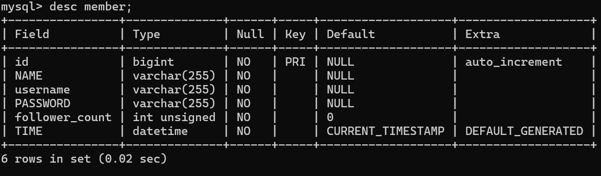

# Task 2: Create database and table in your MySQL server

- Create a new database named website.

  SQL : create database website;

  outcome :

  

- Create a new table named member, in the website database

  SQL :

  ```sql
  CREATE TABLE member (
  id BIGINT PRIMARY KEY AUTO_INCREMENT,
  name VARCHAR(255) NOT NULL,
  username VARCHAR(255) NOT NULL,
  password VARCHAR(255) NOT NULL,
  follower_count INT UNSIGNED NOT NULL DEFAULT 0,
  time DATETIME NOT NULL DEFAULT CURRENT_TIMESTAMP
  );

  ```

  outcome :

  
