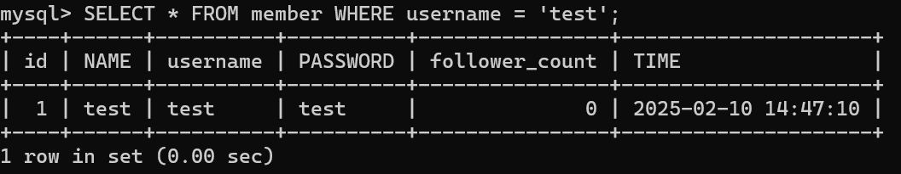

# Task 2: Create database and table in your MySQL server

### Create a new database named website.

SQL :

```sql
create database website;
```

outcome :


### Create a new table named member, in the website database

SQL :

```sql
CREATE TABLE member (
id BIGINT PRIMARY KEY AUTO_INCREMENT,
name VARCHAR(255) NOT NULL,
username VARCHAR(255) NOT NULL,
password VARCHAR(255) NOT NULL,
follower_count INT UNSIGNED NOT NULL DEFAULT 0,
time DATETIME NOT NULL DEFAULT CURRENT_TIMESTAMP
);

```

outcome :


---

# Task 3: SQL CRUD

### INSERT a new row to the member table where name, username and password must be set to test. INSERT additional 4 rows with arbitrary data.

SQL :

```sql
INSERT INTO MEMBER (NAME,username,PASSWORD) VALUES('test','test','test');

INSERT INTO member (name, username, password, follower_count, time)
VALUES
('Sean', 'Sean123', 'password1', 1),
('Adam', 'Adam123', 'password2', 250),
('Bob', 'Bob123', 'password3', 50),
('Cersei', 'Cersei123', 'password4', 800);

```

outcome :


### SELECT all rows from the member table.

SQL:

```sql
SELECT * FROM MEMBER;
```

outcome :


### SELECT all rows from the member table, in descending order of time.

SQL:

```sql
SELECT * FROM MEMBER ORDER BY time DESC;
```

outcome :


### SELECT total 3 rows, second to fourth, from the member table, in descending order of time

SQL:

```sql
SELECT * FROM member ORDER BY time DESC LIMIT 3 OFFSET 1;

```

outcome :


### SELECT rows where username equals to test.

SQL:

```sql
SELECT * FROM member WHERE name = 'test';

```

outcome :



### SELECT rows where name includes the es keyword.

SQL:

```sql
SELECT * FROM member WHERE name LIKE '%es%';

```

outcome :


### SELECT rows where both username and password equal to test.

SQL:

```sql
SELECT * FROM member WHERE username = 'test' AND password = 'test';

```

outcome :


### UPDATE data in name column to test2 where username equals to test.

SQL:

```sql
UPDATE MEMBER SET name = 'test2' WHERE username = 'test';
```

outcome :


