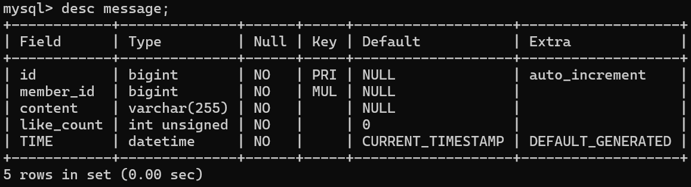

# Task 2: Create database and table in your MySQL server

### 1. Create a new database named website.

SQL :

```sql
create database website;
```

outcome :


### 2. Create a new table named member, in the website database

SQL :

```sql
CREATE TABLE member (
id BIGINT PRIMARY KEY AUTO_INCREMENT,
name VARCHAR(255) NOT NULL,
username VARCHAR(255) NOT NULL,
password VARCHAR(255) NOT NULL,
follower_count INT UNSIGNED NOT NULL DEFAULT 0,
time DATETIME NOT NULL DEFAULT CURRENT_TIMESTAMP
);

```

outcome :


---

# Task 3: SQL CRUD

### 1. INSERT a new row to the member table where name, username and password must be set to test. INSERT additional 4 rows with arbitrary data.

SQL :

```sql
INSERT INTO MEMBER (NAME,username,PASSWORD) VALUES('test','test','test');

INSERT INTO member (name, username, password, follower_count, time)
VALUES
('Sean', 'Sean123', 'password1', 1),
('Adam', 'Adam123', 'password2', 250),
('Bob', 'Bob123', 'password3', 50),
('Cersei', 'Cersei123', 'password4', 800);

```

outcome :


### 2. SELECT all rows from the member table.

SQL:

```sql
SELECT * FROM MEMBER;
```

outcome :


### 3. SELECT all rows from the member table, in descending order of time.

SQL:

```sql
SELECT * FROM MEMBER ORDER BY time DESC;
```

outcome :


### 4. SELECT total 3 rows, second to fourth, from the member table, in descending order of time

SQL:

```sql
SELECT * FROM member ORDER BY time DESC LIMIT 3 OFFSET 1;

```

outcome :


### 5. SELECT rows where username equals to test.

SQL:

```sql
SELECT * FROM member WHERE name = 'test';

```

outcome :


### 6. SELECT rows where name includes the es keyword.

SQL:

```sql
SELECT * FROM member WHERE name LIKE '%es%';

```

outcome :


### 7. SELECT rows where both username and password equal to test.

SQL:

```sql
SELECT * FROM member WHERE username = 'test' AND password = 'test';

```

outcome :


### 8. UPDATE data in name column to test2 where username equals to test.

SQL:

```sql
UPDATE MEMBER SET name = 'test2' WHERE username = 'test';
```

outcome :


---

# Task 4: SQL Aggregation Functions

### 1. SELECT how many rows from the member table.

SQL:

```sql
SELECT COUNT(*) AS total_rows FROM member;
```

outcome :


### 2. SELECT the sum of follower_count of all the rows from the member table.

SQL:

```sql
SELECT SUM(follower_count) AS total_followers FROM member;
```

outcome :


### 3. SELECT the average of follower_count of all the rows from the member table.

SQL:

```sql
SELECT AVG(follower_count) AS avg_followers FROM member;
```

outcome :


### 4. SELECT the average of follower_count of the first 2 rows, in descending order of follower_count, from the member table.

SQL:

```sql
SELECT AVG(follower_count) AS avg_followers_for_MostTwo_ FROM (SELECT follower_count FROM member ORDER BY follower_count DESC LIMIT 2) AS top2;
```

outcome :


---

# Task 5: SQL JOIN

### 1. Create a new table named message, in the website database. designed as below:

SQL:

```sql
CREATE TABLE message (
    id BIGINT PRIMARY KEY AUTO_INCREMENT,
    member_id BIGINT NOT NULL,
    content VARCHAR(255) NOT NULL,
    like_count INT UNSIGNED NOT NULL DEFAULT 0,
    TIME DATETIME NOT NULL DEFAULT CURRENT_TIMESTAMP,
    FOREIGN KEY (member_id) REFERENCES member(id)
);
```

outcome :



### 2. SELECT all messages, including sender names. We have to JOIN the member table to get that.

SQL:

```sql
SELECT member.name AS senders, message.* FROM message JOIN member ON  message.member_id = member.id;
```

outcome :


### 3. SELECT all messages, including sender names, where sender username equals to test. We have to JOIN the member table to filter and get that.

SQL:

```sql
SELECT member.name AS senders, message.* FROM message JOIN member ON  message.member_id = member.id WHERE member.username ='test';
```

outcome :


### 4. Use SELECT, SQL Aggregation Functions with JOIN statement, get the average like count of messages where sender username equals to test.

SQL:

```sql
SELECT AVG(message.like_count) AS avg_likes FROM message JOIN member ON message.member_id = member.id WHERE member.username ='test';
```

outcome :


### 5. Use SELECT, SQL Aggregation Functions with JOIN statement, get the average like count of messages GROUP BY sender username.

SQL:

```sql
SELECT member.username AS username, AVG(message.like_count) AS avg_likes FROM message JOIN member ON  message.member_id = member.id GROUP BY member.username;

```

outcome :


